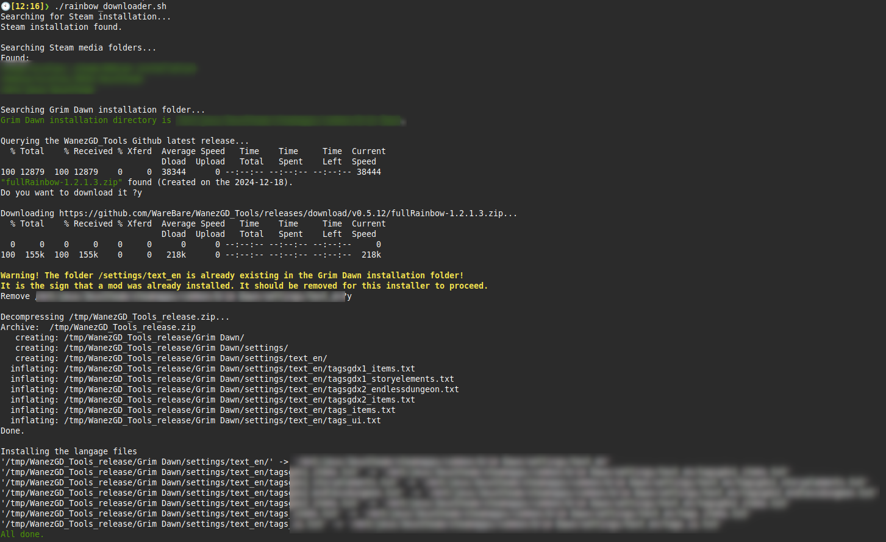

This is a downloader to automatically install the latest Rainbow Filter mod from https://github.com/WareBare/WanezGD_Tools for Linux installations of **Grim Dawn**.

_Please note that it does not fully install the Wanez tools collection, just the Rainbow filter._

It does the following;

  * Find the Steam installation (note: currently it only searches in `$HOME/.steam/debian-installation/`. Contact me if it should be modified)
  * Find the Steam media folders
  * Find where Grim Dawn is installed
  * Download the latest release of WanezGD_Tools
  * Install the Rainbow Filter mod in the Grim Dawn installation.

Prerequisites:

_jq_ and _curl_.

Sample run, as a normal user:

